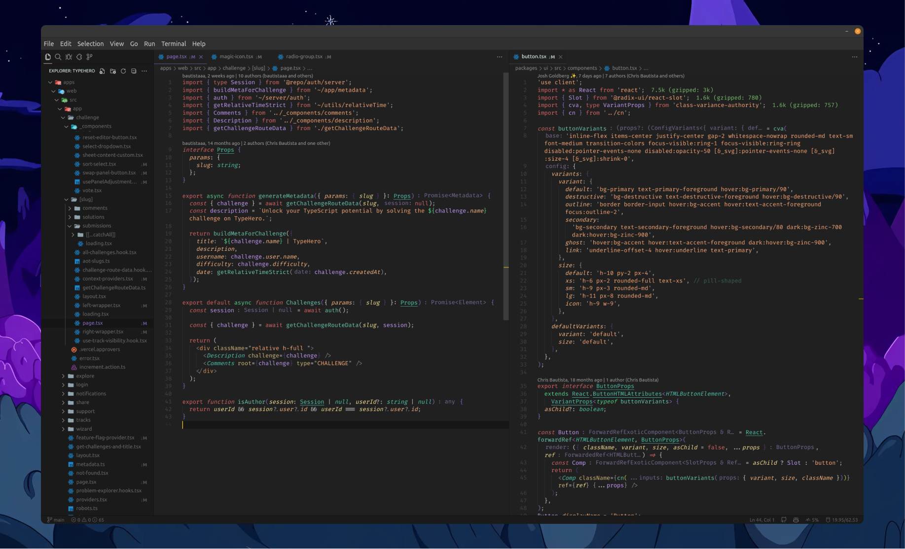

# 🦇 Halloween Night – Zed Edition

## 🍷 A sinister cocktail brewed with the finest vampire blood, a splash of spiced pumpkin juice, crushed spider legs for texture, a dash of clown hair for an eerie twist, and topped with a sprinkle of grave soil for that final touch of dread. Sip... if you dare. Bon appétit!

The beloved **Halloween Night** theme, now ported to **Zed**. Originally built for VS Code, this dark Halloween-themed color scheme brings its signature moody purples, blood-red keywords, pumpkin-orange strings, and ghostly whites to your Zed editor.



---

## 🎁 Bonus Icons

| Icon                                                      | Dark App Icon                                                | Light App Icon                                                 |
| --------------------------------------------------------- | ------------------------------------------------------------ | -------------------------------------------------------------- |
|                           |              |              |
| [Download](assets/icons/icon.png)                         | [Download](assets/icons/appIconDark.png)                     | [Download](assets/icons/appIconLight.png)                      |

---

## 🚀 Quick Start

### Install from Zed Extensions

1. Open Zed
2. Open the command palette (`Ctrl+Shift+P` / `Cmd+Shift+P`)
3. Run `zed: extensions`
4. Search for **Halloween Night**
5. Click **Install**

### Install as a Dev Extension (for local development)

1. Open Zed
2. Open the command palette
3. Run `zed: install dev extension`
4. Select this repository's root directory
5. Select **Halloween Night** from the theme selector (`Ctrl+K Ctrl+T` / `Cmd+K Cmd+T`)

### Install as a Local Theme

Copy the theme file directly to Zed's themes directory:

```bash
mkdir -p ~/.config/zed/themes
cp themes/halloween-night.json ~/.config/zed/themes/
```

Then restart Zed and select it from the theme selector.

---

## 🛠️ Debugvelopment / Debugging

### Prerequisites

- [Zed](https://zed.dev) installed
- Git

### Setup

```bash
# Clone the repo
git clone https://github.com/BlueRexPY/HalloweenNightZed.git
cd HalloweenNightZed
```

### Debug the theme locally

**Option A – Dev Extension (recommended)**

1. Open Zed in this project directory
2. Run `zed: install dev extension` from the command palette
3. Select this directory
4. The theme is now loaded from your local source

**Option B – Local theme copy**

```bash
cp themes/halloween-night.json ~/.config/zed/themes/
```

Restart Zed to pick up changes. Re-copy the file after each edit.

**Option C – Run Zed in foreground for logs**

```bash
zed --foreground
```

This prints extension-related output to the terminal, useful for debugging.

### Making changes

Edit `themes/halloween-night.json`. The file follows the [Zed theme schema v0.2.0](https://zed.dev/docs/themes).

**Key sections:**
- `style.*` – UI chrome colors (panels, tabs, status bar, etc.)
- `style.players[]` – Cursor and selection colors per collaborator
- `style.syntax.*` – Tree-sitter–based syntax highlighting captures
- `style.terminal.ansi.*` – Terminal color palette

**Workflow:**
1. Edit the JSON
2. Restart Zed (or re-run `zed: install dev extension`)
3. Preview in the theme selector

---

## 📦 Publishing

### Prerequisites

- Your extension repository must be **public** on GitHub
- Your extension must include an accepted [license](https://zed.dev/docs/extensions/developing-extensions#extension-license-requirements) (this repo uses MIT ✅)
- Your `extension.toml` must have a unique `id` and correct metadata
- Test your extension **locally** as a dev extension first

### Step-by-step Publishing

1. **Fork** the [zed-industries/extensions](https://github.com/zed-industries/extensions) repo to your personal GitHub account

2. **Clone** your fork:
   ```bash
   git clone https://github.com/YOUR_USERNAME/extensions.git
   cd extensions
   git submodule init
   git submodule update
   ```

3. **Add your extension as a submodule:**
   ```bash
   git submodule add https://github.com/BlueRexPY/HalloweenNightZed.git extensions/halloween-night-theme
   ```

4. **Update `extensions.toml`** at the repo root:
   ```toml
   [halloween-night-theme]
   submodule = "extensions/halloween-night-theme"
   version = "0.3.3"
   ```

5. **Sort the extensions list:**
   ```bash
   pnpm sort-extensions
   ```

6. **Commit and open a PR** against `zed-industries/extensions`

7. Once merged, your extension will be **automatically published** to the Zed extension registry.

### Updating an existing extension

```bash
cd extensions
git submodule update --remote extensions/halloween-night-theme
# Update the version in extensions.toml
pnpm sort-extensions
# Commit and open a PR
```

---

## 📁 Project Structure

```
HalloweenNightZed/
├── extension.toml              # Zed extension manifest
├── themes/
│   └── halloween-night.json    # Theme definition
├── assets/
│   ├── icons/                  # Icons for the theme
│   └── screenshots/            # Preview screenshots
├── LICENSE.md                  # MIT License
├── README.md                   # This file
└── .gitignore
```

---

## 🎨 Color Palette

| Role        | Color     | Hex       |
|-------------|-----------|-----------|
| Background  | Dark void | `#1a1a1a` |
| Editor BG   | Deep abyss | `#202020` |
| Foreground  | Ghostly   | `#eeffff` |
| Accent      | Vampiric purple | `#8669c4` |
| Cursor      | Jack-o'-lantern | `#ffcc00` |
| Keywords    | Blood red | `#DB6363` |
| Strings     | Pumpkin   | `#FFA977` |
| Functions   | Witch brew | `#6ACCB4` |
| Types       | Toxic green | `#4EC9B0` |
| Variables   | Spider silk | `#c89cfe` |
| Numbers     | Potion purple | `#9c7cd4` |
| Comments    | Graveyard moss | `#575599` |

---

## 📄 License

MIT – see [LICENSE.md](./LICENSE.md)

---

## 🔗 Links

- [Original VS Code Theme](https://github.com/BlueRexPY/HalloweenNight)
- [Zed Theme Documentation](https://zed.dev/docs/themes)
- [Zed Extension Development](https://zed.dev/docs/extensions/developing-extensions)
